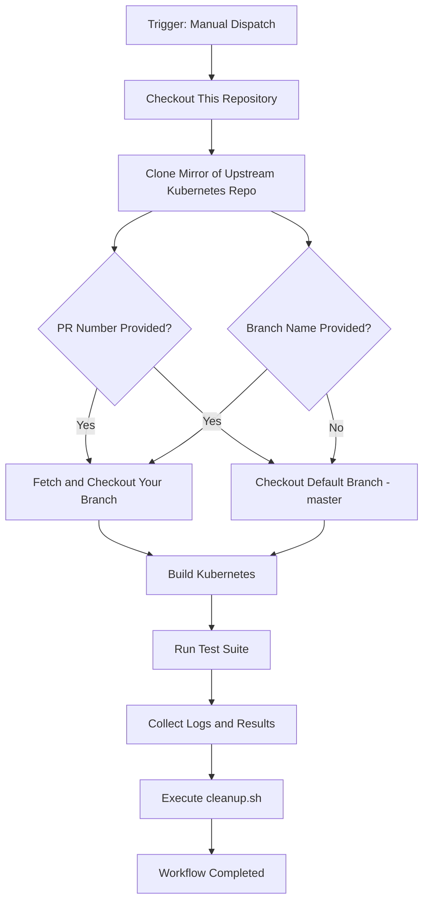

# Test Infra Repo

------------------------------------------------------------------------

## 📌 Overview

The **Test Infra** repository provides an isolated GitHub
Actions--based automation framework for testing Kubernetes pull
requests for IPVS-related changes.

It enables maintainers to:

-   Checkout a specific PR from upstream repo
-   Test changes made in Kubernetes repo mirror
-   Execute validation and test workflows

This keeps CI logic separate from the Kubernetes upstream repository
hosted at k8sIPvS/kubernetes

------------------------------------------------------------------------

## 🏗 Repository Structure

    .
    ├── .github/
    │   └── workflows/
    │       └── basic_k8s.yml     # Core GitHub Actions workflow
    ├── lab                       # Local workstation IPVS lab automation
    └── README.md                 # 

------------------------------------------------------------------------

## ⚙️ Workflow Description

The primary automation logic resides in:

    .github/workflows/basic_k8s.yml

### Workflow Responsibilities

1.  Trigger on:
    -   Manual dispatch (`workflow_dispatch`) for better controll over batches of changes
        to be testes
2.  Accept input parameter:
    -   `pr_number` (optional) - fetches PR at given number from upstream Kubernetes repo
        at github.com
    -   `branch` (optional) - branch in k8sIPvS/kubernetes with your changes
3.  Execute pipeline steps:
    -   Checkout repository
    -   Fetch PR branch (if provided)
    -   Checkout your branch by given name, default master
    -   Run build/test steps
    -   Output logs

------------------------------------------------------------------------

## 🔄 Workflow Diagram

Below is a high-level execution flow of the CI process.

------------------------------------------------------------------------

## 🧪 Manual Execution Steps

To manually test a Kubernetes PR:

1.  Navigate to the **Actions** tab in GitHub.
2.  Select the workflow.
3.  Click **Run workflow**.
4.  Enter a PR number (optional).
5.  Enter branch from k8sIPvS/kubernetes with your changes pushed
5.  Start execution.

------------------------------------------------------------------------

## 🚀 Example Use Case

Testing Kubernetes PR #12345:

1.  Dispatch workflow
2.  Input `12345`
3.  Leave branch as 'master'
4.  Workflow:
    -   Clones upstream
    -   Checks out PR
    -   Runs validation
    -   Reports status

------------------------------------------------------------------------

## 📈 Potential Improvements

-   Multi-platform validation
-   Artifact uploads
-   Parallel test jobs
-   Slack/Email notifications
-   Caching dependencies for faster builds

------------------------------------------------------------------------

## 📄 License

